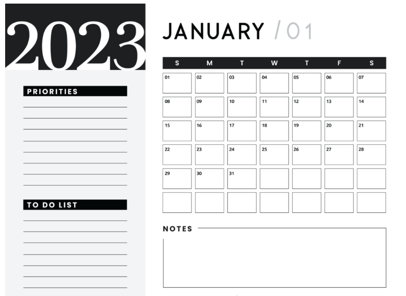

# Calendar

This project is the second of a series of HTML and CSS exercises suggested by [csbatista](https://github.com/csbatista) in order for me to improve my coding skills

## Scope

The exercise consists in reproduce the image below, it doesn't need to be responsive. I used both flex-box and grid to achieve the final result.

**You can find the final project** [here](https://dadaniela.github.io/calendar/)